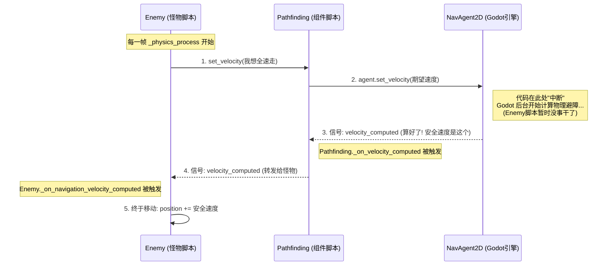

# Godot 寻路代码完全解析 (逐行代码对照版)

如果之前的比喻不好懂，那我们直接来看代码。怪物的移动是**Pathfinding(工具箱)**和**Enemy(使用者)**两个脚本配合完成的。

## 1. Pathfinding.gd (工具箱)

这个脚本的作用是**把复杂的 Godot 导航功能包一层**，变成只有 4 个简单按钮的遥控器，让怪物来按。

| 函数名 (按钮) | 作用 (通俗解释) | 对应 Godot 内部逻辑 |
| :--- | :--- | :--- |
| **_ready()** | **开机初始化** | 创建 `NavigationAgent2D` 并在 Godot 服务器里注册这个单位。 |
| **set_target_position()** | **设定终点** | 告诉导航仪：“我要去(x, y)这个坐标”。Godot 会在后台默默计算出一条蓝色的路线。 |
| **get_next_path_position()** | **问路：下一步踩哪？** | 导航仪不会一次把整条路告诉你，它只告诉你**当前**应该踩的下一个具体的点（WayPoint）。 |
| **set_velocity()** | **申请：我想这么走** | 拿着你想走的速度（比如向右 100），提交给 Godot 避障系统。**注意：这一步不会移动怪物！只是提交申请！** |
| **_on_velocity_computed()** | **结果：批准的速度** | 这是个监听器。Godot 算好避障后，会把**真正安全的速度**传给这个函数，然后这个函数再发信号通知怪物。 |

---

## 2. Enemy.gd (使用者)

怪物每一帧都在不停地按这几个按钮。我们来看看 `_physics_process` 里发生了什么。

### 第 1 步：我想去哪？(设定目标)

```gdscript
# Enemy.gd
# 限制了频率，每 0.2 秒才喊一次，不然太累
if _last_path_update_time >= PATH_UPDATE_INTERVAL:
    # 【调用 Pathfinding】：嘿，那个玩家在那边，给我规划路线！
    pathfinding.set_target_position(player.global_position)
```

### 第 2 步：眼下该往哪迈腿？(获取方向)

```gdscript
# Enemy.gd
# 【调用 Pathfinding】：在规划好的路线上，我脚下正前方那个路点在哪？
var next_path_pos = pathfinding.get_next_path_position()

# 算出方向：路点在右边，那我就该往右用劲
var direction = (next_path_pos - global_position).normalized()
```

### 第 3 步：提交申请 (期望速度)

```gdscript
# Enemy.gd
# 我全速前进是 speed (20)，所以我想以 Vector2(20, 0) 的速度向右冲
var desired_velocity = direction * speed

# 【调用 Pathfinding】：我想用这个速度走，帮我过一下避障系统！
pathfinding.set_velocity(desired_velocity)

# 此时，怪物并没有移动！代码运行到这里就结束了！
# 怪物在等通知。
```

### 第 4 步：收到通知，真正移动 (回调执行)

这是在一个单独的函数里，只有当 Godot 避障算完了才会触发。

```gdscript
# Pathfinding.gd 发出了信号 -> Enemy.gd 收到了
func _on_navigation_velocity_computed(safe_velocity: Vector2):
    # safe_velocity 是 Godot 修改后的“安全速度”
    # 比如你想向右走(20,0)，但右边有人，Godot 可能会给你 (18, 5) 让你稍微往上偏一点

    # 这里才真正修改了坐标！
    position += safe_velocity * delta
```

---

## 3. 为什么不直接在第 2 步移动？

你可能会问，既然都知道 `direction` 了，为什么不直接 `position += direction * speed`？

*   **如果不避障**：完全可以！直接走就是直线冲过去，不管路上有没有同伴，所有怪物会重叠成一个点。
*   **如果要避障**：你就不能“想怎么走就怎么走”。你必须把你的“想法”提交给系统，系统统筹计算所有人的位置后，发给你一个“并不会撞车”的速度。

---

## 4. 信号流程图解 (Sequence Diagram)

之所以看不懂，通常是因为这里有一个**“时间差”**。

1.  代码运行是**从上到下**的，但在“避障”这里，代码**断开**了。
2.  `set_velocity` 只是发了一个请求，然后函数就结束了。
3.  过了可能几毫秒（在同一帧的稍后时间），Godot 算完了，才突然通过信号“打电话”回来。



---

## 5. 深入解析：Pathfinding 中的魔法连线

我们在 `Pathfinding.gd` 中看到的这段代码是整个流程的关键：

```gdscript
func set_velocity(velocity: Vector2):
    if agent.avoidance_enabled:
        # 1. 提交请求：告诉 Godot "我想用这个速度走"
        agent.set_velocity(velocity)
        # 2. 此时函数直接结束了！_on_velocity_computed 还没有运行！
    else:
        # 如果没开避障，不想麻烦 Godot 算，我们自己手动调用
        _on_velocity_computed(velocity)
```

**问题：** `agent.avoidance_enabled` 为 true 时，谁去调用 `_on_velocity_computed`？

**答案：** Godot 引擎通过**电话线**(Signal Connection)自动调用。

秘密藏在 `_ready()` 里的这行代码：
```gdscript
agent.velocity_computed.connect(_on_velocity_computed)
```

这就像是跟 Godot 签了一个合同：
1.  **寄信模式 (开启避障)**：你把速度通过 `agent.set_velocity` 扔进邮箱。Godot 会在后台收信、计算，算好后通过上面那个合同（Connect），**自动远程调用**你的 `_on_velocity_computed` 函数。
2.  **自言自语模式 (关闭避障)**：因为没开避障，Godot 不会理你，也不会给你打电话。如果你还傻等，怪物就永远不会动了。所以我们在 `else` 里**手动调用** `_on_velocity_computed`，假装收到了 Godot 的回复，把原速发出去。
